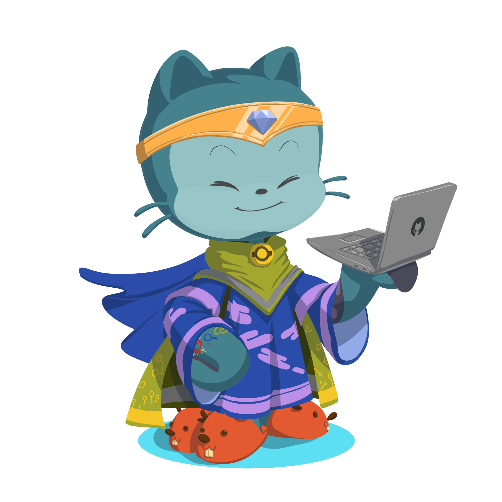

# Senjia12

<table style="border-collapse: collapse;">
<tr>
<td width="70%" style="border: none;>

Full Stack Web development | Cybersecurity, ethical hacking | AI | Game development

## :octocat: Occupations

- Undergraduate student in 2 degrees simultaneously :
    - CS
    - Psychology
- Programming enthusiast
- Soon-to-be freelancer in web development

</td>
<td width="30%" style="border: none;">
    
</td>
</tr>
</table>

# :notebook_with_decorative_cover: My Tech Toolbox

## :busts_in_silhouette: Social

<!--  -->

Email me :

### :mortar_board: Academic

## :globe_with_meridians: Web

## :video_game: Game

## :bar_chart: Data Science

## :bookmark_tabs: Project management

## :desktop_computer: Operating System

## :robot: Virtual machines and emulation

## :art: Design, graphics

<!-- ## :wrench::gear: Systems Programming

In progress...

## :iphone: Mobile

In progress... -->

## :paperclip: Miscellaneous

<!--  -->

## :bookmark_tabs: Office

<!-- 

 -->